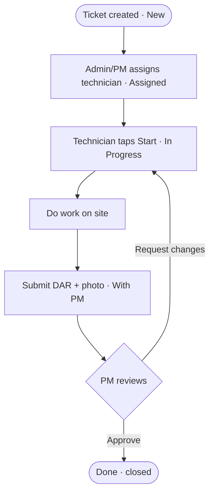
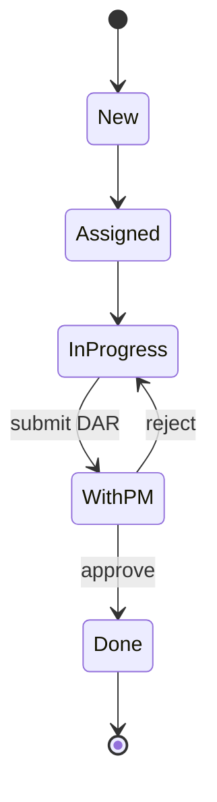
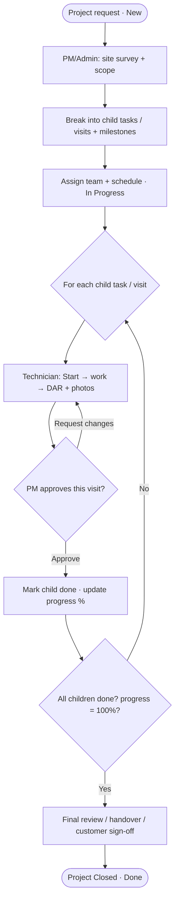
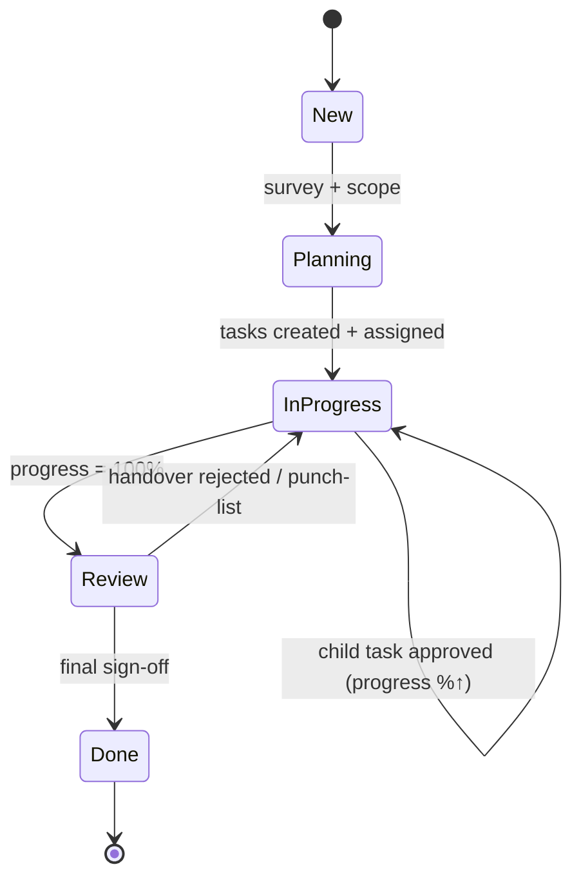
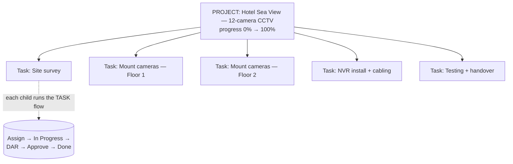
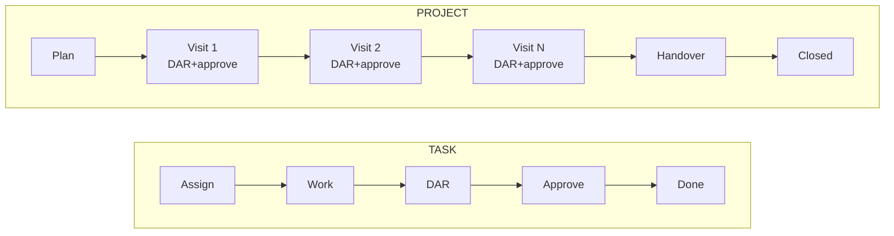

# Workflow — Task (Service) vs Project

Same data model (a ticket), but the **lifecycle differs**. A **task** is one
visit → one report → one approval → done. A **project** is a *container* of
many task-cycles, tracked by progress, ending in a final handover.

Developer reference. Mermaid diagrams render in GitHub / VS Code preview.

---

## 1. The core difference

| | **Task** (Service / Other) | **Project** |
|---|---|---|
| Size | one visit, one job | multi-visit, multi-day |
| Structure | single ticket | **parent that contains child tasks** |
| Technician | usually one | often a team |
| Reports (DAR) | **one** DAR closes it | **one DAR per visit** |
| Approval | single PM approval → Done | approval per visit **+ final handover** |
| Tracking | status only | **progress %** across child tasks |
| Closure | PM approves | progress = 100% **+** final sign-off |
| Example | "AC not cooling" | "Hotel — 12-camera CCTV install" |

> **Data note:** still one `tickets` table. A project is a ticket with
> `type = Project` that has **child tickets** (`parent_id`). Each child is an
> ordinary task with its own DAR cycle. Project progress = % of children Done.

---

## 2. TASK flow (Service ticket) — simple, linear

**One cycle. One DAR. One approval. Done.**

---

## 3. PROJECT flow — a container of task-cycles

A project adds **planning** up front and a **final handover** at the end, and
loops through its child tasks/visits in the middle.

**Many cycles. Many DARs. Progress accrues. Final handover closes it.**

---

## 4. How a project contains tasks (hierarchy)

Every child task in §4 runs the **Task flow** from §2. When the last child is
approved, the parent project hits 100% and goes to **final handover**.

---

## 5. Side-by-side timeline

---

## 6. What changes for the build

| Concern | Task | Project |
|---|---|---|
| Records | 1 ticket | 1 parent + N child tickets (`parent_id`) |
| Progress | derived from status | `done_children / total_children` |
| Approvals | 1 | N (per visit) + 1 final |
| DARs | 1 | many (1 per visit) |
| Extra screens | — | project detail with child-task list + progress, handover step |
| Permissions | same | PM sees whole project tree; technician sees only their child task |

> **MVP shortcut:** if time is tight, ship Projects as a *flat* ticket with a
> manual `progress %` field (no child tasks). Add the parent→child task tree in
> Phase 2 — the diagrams above are the target model.
