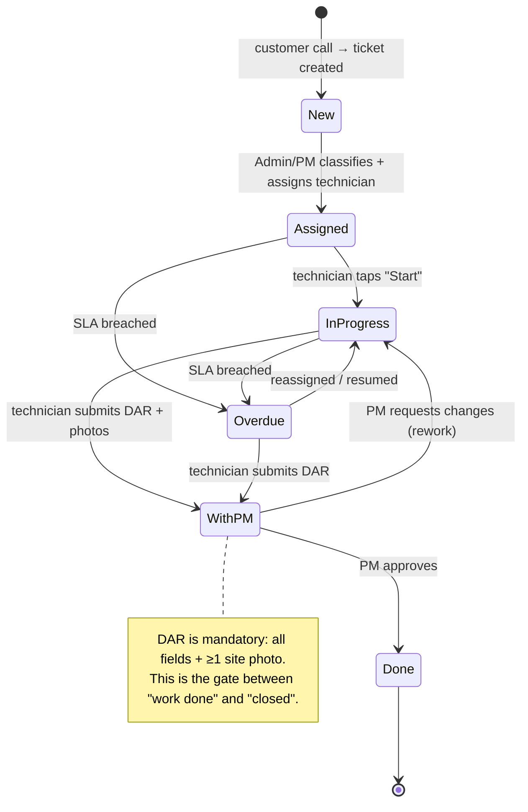
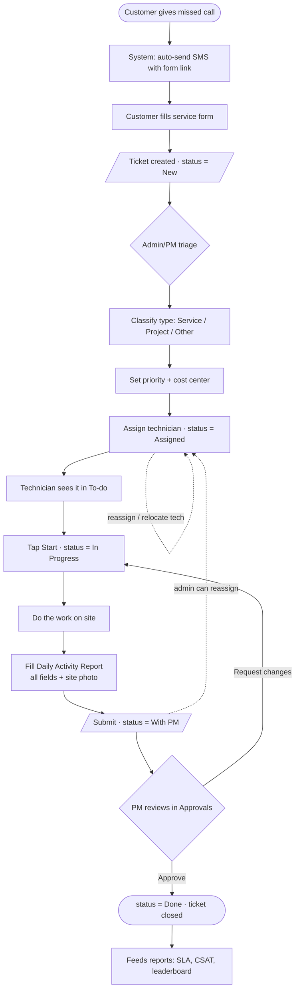
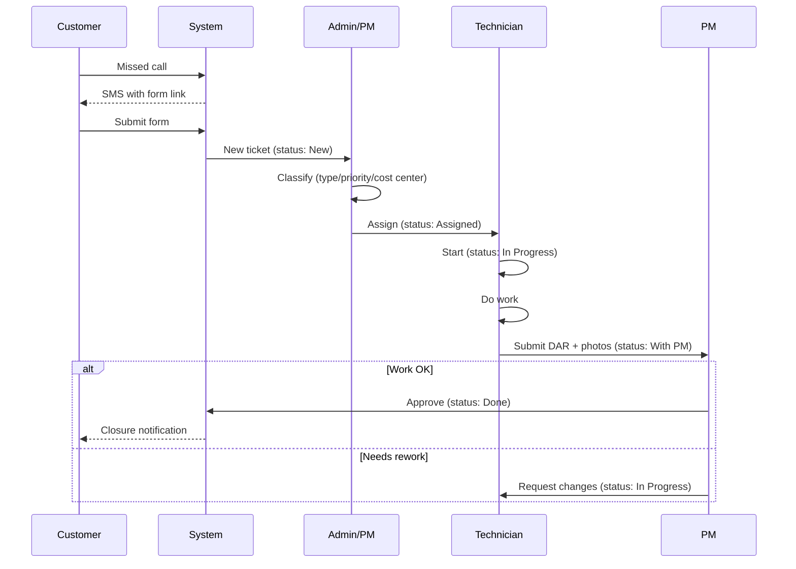
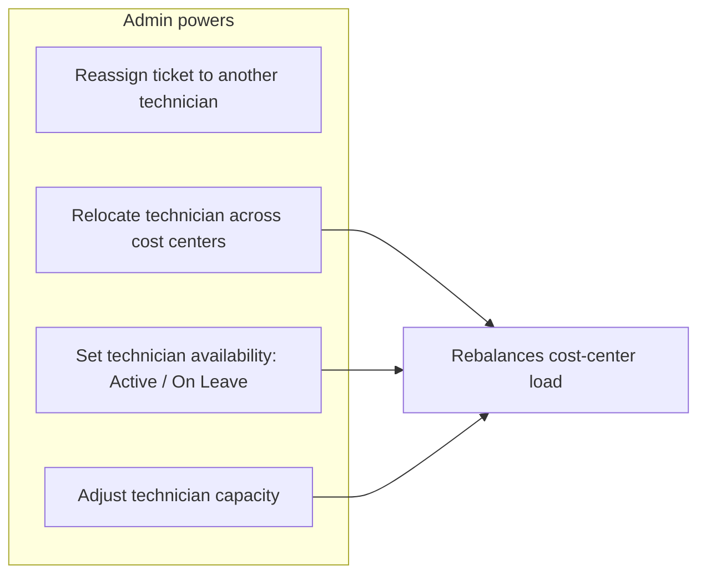

# ServiceHub — Task / Project Workflow (developer reference)

End-to-end lifecycle of a ticket, from the customer's first call to closure.
This is the internal logic spec — **not** an end-user guide. Diagrams use
Mermaid (renders in GitHub / VS Code Markdown preview).

---

## 1. Actors

| Actor | Role in the flow |
|---|---|
| **Customer** | Raises the request (missed call → SMS link → form). Sees only their own ticket. |
| **Admin** | Org-wide. Triages, classifies, assigns; relocates technicians across cost centers; sets availability/capacity. |
| **PM (Project Manager)** | Owns a cost center's work. Assigns to technicians, **approves/rejects** completed work. |
| **Technician** | Field worker. Executes the task, submits the **Daily Activity Report (DAR)** + photos. |
| **System** | Auto-creates ticket from missed call, runs SLA timers, sends notifications. |

---

## 2. Ticket model (the unit of work)

A **ticket = task**. A "project" is just a ticket with `type = Project`.

| Field | Values / notes |
|---|---|
| `id` | `SR-####` (Service), `PR-####` (Project), `OT-####` (Other) |
| `type` | **Service** \| **Project** \| **Other** |
| `priority` | Urgent \| High \| Medium \| Low |
| `cost_center` | Calicut \| Kollam \| Ernakulam |
| `customer` | name / site |
| `assignee` | technician (nullable until assigned) |
| `status` | New → Assigned → In Progress → With PM → Done (+ Overdue flag) |
| `dar` | Daily Activity Report (required to close) + photos |

---

## 3. Status lifecycle (state machine)

**Status meanings**

| Status | Meaning | Who acts next |
|---|---|---|
| **New** | Created, unassigned | Admin / PM |
| **Assigned** | Given to a technician (shows in their **To-do**) | Technician |
| **In Progress** | Technician started on site | Technician |
| **With PM** | DAR submitted, awaiting sign-off | PM |
| **Done** | PM approved → closed (billable) | — |
| **Overdue** | SLA breached (overlay flag, not a dead end) | Admin / PM |

---

## 4. End-to-end flow (call → close)

---

## 5. Who-does-what (sequence view)

---

## 6. Service vs Project — same flow, different shape

| | **Service** ticket | **Project** ticket |
|---|---|---|
| Scope | one visit, one job | multi-visit, multi-day |
| DAR | one DAR closes it | a DAR per visit; progress % tracked |
| Closure | single PM approval → Done | progress reaches 100% + final approval |
| Example | "AC not cooling" | "Hotel — 12-camera CCTV install" |

> Same state machine applies to both. A Project simply loops
> `In Progress → With PM → (approve) → In Progress` across visits until
> `progress = 100%`, then the final approval sets it to **Done**.

---

## 7. Admin overrides (cross-cutting)

These don't change the ticket states, but the Admin can act at any point:

- **Reassign** → ticket's `assignee` changes (stays in same status).
- **Relocate / availability / capacity** → affects *future* assignment & the
  Deployment load board; does not auto-move existing tickets.

---

## 8. Notifications (triggers)

| Event | Notify | Channel |
|---|---|---|
| Ticket created | Admin/PM | in-app / email |
| Ticket assigned | Technician | push (mobile) |
| DAR submitted | PM | in-app / push |
| Approved / closed | Customer + Technician | SMS / push |
| Changes requested | Technician | push |
| SLA breach (Overdue) | PM + Admin | in-app / email |

---

## 9. Implementation notes (for the real build)

- **State transitions** should be enforced server-side (a ticket can't jump
  `New → Done`). Keep a `status_history` / audit table (who, when, from→to).
- **DAR** is the hard gate: server validates required fields + ≥1 photo before
  allowing `In Progress → With PM`.
- **Photos** → object storage (S3 / R2), signed URLs, mobile-side compression.
- **Permissions (RLS):** Customer = own ticket; Technician = own assigned;
  PM = own cost center(s); Admin = all.
- **Overdue** is a derived flag from SLA timer, not a manual status.
